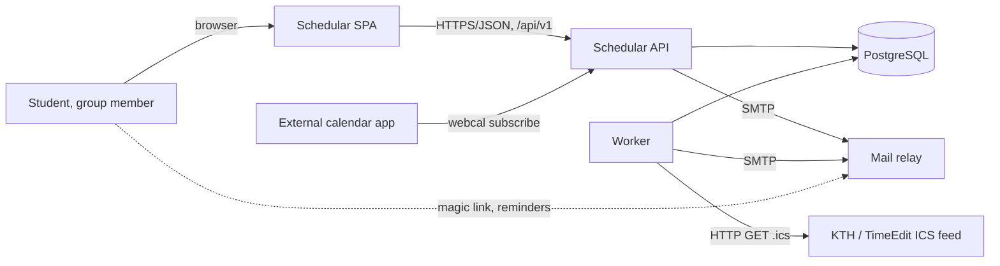
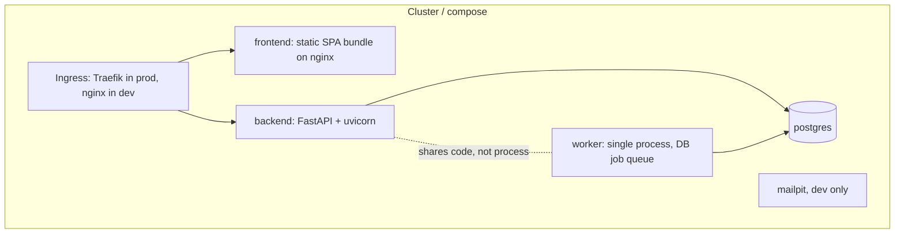
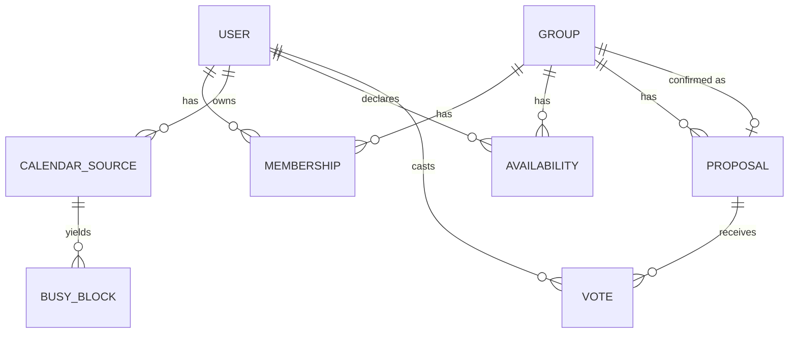
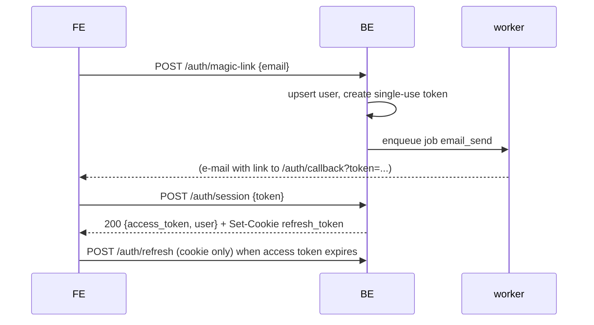
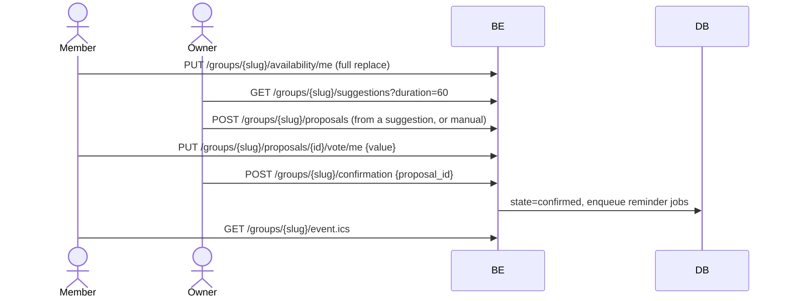

# Schedular: Architecture Overview (v1 draft)

Authors: Adrian Grund, Alexander Runebou
Status: draft for review, normative for code generation
Companion files: `contracts/openapi.yaml` (normative API contract), `CLAUDE.md` (generation rules)

---

## 1. Purpose

This document fixes the parts of the system that two people (and an AI code generator) cannot
negotiate at runtime: the domain model, the API contract, the limits, the failure behaviour and
the deployment topology. Anything not written down here or in `openapi.yaml` is an
implementation detail owned by whoever writes that component.

Rule of precedence when sources disagree:

1. `contracts/openapi.yaml`
2. this document
3. generated code

If the code and the contract disagree, the code is wrong.

---

## 2. Decisions

| # | Decision | Consequence |
|---|---|---|
| D1 | Identity: lightweight accounts, e-mail plus magic link, no passwords stored | No password hashing, no reset flow, no KTH SSO client registration |
| D2 | Two layers: an availability heatmap plus backend-computed suggestions (layer 1), then explicit proposals that members vote on and the owner confirms (layer 2) | `Availability`, `Suggestion` (computed, not stored), `Proposal`, `Vote` are separate concepts |
| D3 | A group has exactly one owner, who alone confirms, edits and deletes | `role` on membership, `403 forbidden` with code `not_owner` |
| D4 | Fixed 30-minute slots, all instants UTC RFC 3339, group carries an IANA timezone used only for rendering | Frontend never sends local wall-clock time to the API |
| D5 | No recurrence rules anywhere; `RRULE` is expanded at ICS import time into concrete instances | The API has no recurrence vocabulary |
| D6 | ICS import by both file upload and stored subscription URL, parsed server-side only | Frontend never parses ICS |
| D7 | "Sync" means: backend re-polls ICS URLs (6 h), and export is a subscribable feed. Live co-editing is ETag polling every 15 s, no WebSockets | No realtime infrastructure |
| D8 | Export by one-off `.ics` download and by a token-scoped read-only feed | No Google Calendar OAuth |
| D9 | Spec-first. `contracts/openapi.yaml` is hand-written and normative; FastAPI conforms to it, the frontend generates its types from it | CI verifies conformance; frontend is unblocked by a mock server on day one |
| D10 | REST under `/api/v1`, UUIDv7 internally, groups addressed by a 12-character slug, RFC 9457 problem responses with a stable `code`, cursor envelopes on lists, `Idempotency-Key` on mutating requests | See section 7 |
| D11 | Short-lived JWT access token held in memory, refresh token in an HttpOnly cookie, SPA and API on different origins, CORS allow-listed per environment | See risk R1 (no TLS) |
| D12 | The backend is authoritative for all validation; limits are served from `GET /api/v1/config` so neither side hard-codes them | The frontend may duplicate validation for UX only |
| D13 | Production runs Kubernetes on a free-tier target; the platform is replaceable, the manifests are not | See section 11 |
| D14 | PostgreSQL 16, SQLAlchemy 2.0 and Alembic; schema owned by the backend author | Only the ERD and its invariants are fixed here |
| D15 | Mail is an abstract interface: Mailpit in dev, an SMTP relay in prod (Brevo, Resend or a Gmail app password). No dependency on KTH mail | `SMTP_*` env vars only |
| D16 | The circuit breaker lives inside the backend and guards its own database access, with an e-mail notification on state change. No separate watchdog service, no Prometheus stack in v1 | See section 9 |
| D17 | `POST /api/v1/events` and `GET /api/v1/flags` are reserved in the v1 contract and stubbed, so the A/B and analytics milestones need no contract change | A/B proof may be a purely visual frontend variant |
| D18 | MLOps is undefined and is out of the runtime architecture until it is scoped | If it becomes a served model it enters as a fourth container behind its own contract |
| D19 | One monorepo with path-filtered CI | See section 12 |
| D20 | Must-ship scope ends at working dev and prod deployment; monitoring dashboard, A/B and MLOps are optional | Reserved surface stays unimplemented but contracted |

---

## 3. System context



Actors and externals

- Group member: any authenticated user; may own zero or more groups.
- KTH schedule source: an ICS URL (TimeEdit or the personal KTH feed) or an uploaded `.ics` file. Untrusted input.
- Mail relay: outbound SMTP only.
- External calendar: Google Calendar, Apple Calendar or Outlook subscribing to the exported feed. Read-only, unauthenticated, token in the URL.

---

## 4. Container view



| Container | Owner | Responsibility | Explicitly not responsible for |
|---|---|---|---|
| frontend | Adrian | Rendering, local state, optimistic UI, timezone rendering, generated API client | Business rules, ICS parsing, authorization decisions |
| backend | Alexander | All validation and authorization, availability aggregation, suggestion computation, ICS parsing, ICS rendering, JWT issuing, circuit breaker | Sending scheduled mail, polling feeds |
| worker | Alexander | Job loop: ICS polling, reminder scheduling, all outbound mail | Serving HTTP |
| postgres | Alexander | Persistence, single source of truth, job queue | Business logic (no triggers, no stored procedures) |

The backend and the worker are the same image with a different entrypoint. The worker is a
single replica; concurrency safety comes from `SELECT ... FOR UPDATE SKIP LOCKED` on the job
table, so a second replica is safe but unnecessary.

---

## 5. Domain model



Entities and the fields that the contract depends on:

- `user`: `id`, `email` (unique, case-insensitive), `display_name`, `timezone`, `created_at`.
- `magic_link`: `id`, `user_id`, `token_hash`, `expires_at`, `consumed_at`. Single use.
- `refresh_token`: `id`, `user_id`, `token_hash`, `family_id`, `expires_at`, `revoked_at`. Rotating.
- `group`: `id`, `slug` (12 chars, base58, unique), `name`, `description`, `owner_id`, `timezone`, `date_start`, `date_end` (inclusive dates), `window_start_minute`, `window_end_minute` (minutes from local midnight), `slot_minutes` (always 30), `state` (`open` | `confirmed` | `archived`), `confirmed_proposal_id`, `invite_token_hash`, `feed_token_hash`, `version` (monotonic int), timestamps.
- `membership`: `group_id`, `user_id`, `role` (`owner` | `member`), `notify_email`, `joined_at`. Unique on (`group_id`, `user_id`).
- `availability`: `group_id`, `user_id`, `slot_start` (UTC instant), `state` (`available` | `preferred`). Absence of a row means unavailable. Unique on the triple.
- `calendar_source`: `id`, `user_id`, `kind` (`upload` | `url`), `url`, `status` (`ok` | `pending` | `error`), `last_polled_at`, `last_error_code`, `etag`.
- `busy_block`: `id`, `user_id`, `source_id`, `start_at`, `end_at`, `uid`. Derived, regenerated wholesale per source on each successful poll.
- `proposal`: `id`, `group_id`, `start_at`, `end_at`, `origin` (`suggested` | `manual`), `created_by`, `created_at`.
- `vote`: `proposal_id`, `user_id`, `value` (`yes` | `maybe` | `no`). Unique on the pair.
- `job`: `id`, `kind`, `payload` (jsonb), `run_after`, `attempts`, `dedupe_key` (unique when not null), `locked_at`, `completed_at`, `last_error`.

Invariants the backend must enforce (each maps to an error code in section 7.4):

1. Every slot instant submitted must be aligned to `slot_minutes` and fall inside the group's
   date range and daily window, evaluated in the group's timezone. Otherwise `slot_not_in_window`.
2. `date_end - date_start + 1 <= MAX_RANGE_DAYS`. Otherwise `range_too_long`.
3. `window_start_minute < window_end_minute`, both multiples of 30, both in `[0, 1440]`.
4. A group in state `confirmed` rejects all writes to availability, proposals and votes with
   `group_confirmed`. The owner may unconfirm, which returns the group to `open`.
5. `confirmed_proposal_id` is non-null if and only if `state = confirmed`.
6. Membership count never exceeds `MAX_MEMBERS`.
7. The owner cannot leave a group; they must delete it or transfer ownership (transfer is out
   of scope in v1, so: cannot leave).
8. Busy blocks are per user, not per group. A user imports once and it applies everywhere.
9. `version` on the group increments on every change to the group, its memberships, its
   availability, its proposals or its votes. It is the value behind the `ETag`.

### 5.1 Suggestion algorithm (layer 1)

`GET /groups/{slug}/suggestions` is computed on request and never stored. Given a requested
`duration_minutes` (multiple of 30, default 60):

1. Build the ordered slot vector for the group.
2. For each slot, count members whose state is `available` or `preferred`; a member with no
   rows at all counts as "not responded" and is excluded from the denominator.
3. Slide a window of `duration_minutes / 30` consecutive slots over the vector, discarding
   windows that cross a day boundary of the daily window.
4. Score a window as `sum over slots of (2 * preferred_count + 1 * available_count)`, divided
   by the number of slots, and require that every slot in the window has the same set of
   fully available members.
5. Return the top `limit` windows (default 5, max 20), sorted by score descending then start
   ascending, each with the member ids that are available, preferred and missing.

This function is pure, lives in the backend, and is the one piece of logic that must have unit
tests with fixed fixtures. The frontend renders it and does not reimplement it.

---

## 6. Key flows

### 6.1 Sign-in



Access token lifetime 15 minutes, refresh token 30 days, rotated on every use, reuse of a
consumed refresh token revokes the whole family. Magic link lifetime 15 minutes, single use.

### 6.2 Schedule import

The user registers a source. The worker fetches it (job `ics_poll`, also enqueued immediately
on creation and on manual refresh), parses it with a hard cap on size and event count, expands
`RRULE` within the horizon of the user's groups plus 90 days, converts everything to UTC,
replaces the busy blocks for that source in one transaction and marks the source `ok` or
`error`. Busy blocks pre-fill the availability grid as unavailable in the frontend, but they
never write `availability` rows. A user can always override a busy slot by marking it available.

### 6.3 Scheduling round



Availability writes are a full replacement of that user's rows for that group, which makes them
idempotent and avoids patch semantics. The grid view polls
`GET /groups/{slug}/availability` with `If-None-Match` every 15 seconds while visible; a 304 is
the expected common case.

### 6.4 Reminders

On confirmation the backend enqueues one `reminder_send` job per member with `notify_email`
true, with `run_after = start_at - REMINDER_LEAD_HOURS` and a `dedupe_key` of
`reminder:{group_id}:{user_id}:{proposal_id}`. Unconfirming or reconfirming cancels pending
jobs by prefix. Reminders in the past are dropped, not sent late.

### 6.5 Invite and join

One reusable link per group, of the form
`{PUBLIC_APP_URL}/join/{slug}?invite={token}`. It points at the frontend, not the API, because
joining requires an account and the token must survive the sign-in round trip.

1. The frontend route stores the token in `sessionStorage` under a single well-known key and
   checks for a session.
2. If there is none, it runs the magic-link flow with `redirect_path` set back to the same
   route, so the token is still there afterwards.
3. With a session, it calls `POST /groups/{slug}/join` with the token, clears the stored token
   and navigates to the group.

The token is compared against a hash, is rotatable through `PATCH /groups/{slug}` with
`rotate_invite_token`, and rotation invalidates every copy of the old link. An invalid token
gives `404 group_not_found`, not a distinguishable error, so links cannot be probed. Joining
twice is `409 already_member` and the frontend treats it as success. This is the only place the
token is allowed to appear in a URL query string, and the backend must never log query strings
for `/join` or `/feed.ics`.

---

## 7. API contract

Normative file: `contracts/openapi.yaml` (OpenAPI 3.1). This section explains the conventions;
the file is the truth.

### 7.1 Conventions

- Base path `/api/v1`. Breaking changes require `/api/v2`.
- JSON only, `snake_case` keys, UTF-8. All instants are RFC 3339 in UTC with a `Z` suffix.
  Dates are `YYYY-MM-DD`. Durations are integers in minutes.
- Resource ids are UUIDv7 strings. Groups are addressed in URLs by `slug`, never by id.
- Collections return `{"data": [...], "next_cursor": null | "opaque"}` and accept `limit` and
  `cursor`. Never a bare array.
- `POST`, `PUT`, `PATCH` and `DELETE` accept an optional `Idempotency-Key` header (UUID); a
  repeat within 24 hours returns the stored response.
- `GET /groups/{slug}` and the availability and proposal reads return an `ETag` derived from
  the group `version`. Mutations on the group accept `If-Match` and answer `412` with
  `version_conflict` on mismatch.
- Errors are `application/problem+json` per RFC 9457, always including a stable `code`.
- Times sent by the client are always instants. The client never sends a timezone name except
  when setting the group's or the user's timezone.

### 7.2 Endpoints

| Method | Path | Auth | Notes |
|---|---|---|---|
| GET | `/config` | none | Limits, feature flags placeholder, build info |
| POST | `/auth/magic-link` | none | Always `202`, never reveals whether the e-mail exists |
| POST | `/auth/session` | none | Exchanges magic-link token for tokens |
| POST | `/auth/refresh` | cookie | Rotates the refresh token |
| DELETE | `/auth/session` | cookie | Logout, revokes the family |
| GET / PATCH | `/me` | bearer | Display name, timezone, notification default |
| GET / POST | `/me/calendar-sources` | bearer | URL sources |
| POST | `/me/calendar-sources/upload` | bearer | `multipart/form-data`, one `.ics` file |
| POST | `/me/calendar-sources/{id}/refresh` | bearer | Rate limited, `202` |
| DELETE | `/me/calendar-sources/{id}` | bearer | Cascades busy blocks |
| GET | `/me/busy` | bearer | `from`, `to` required, merged busy blocks |
| GET / POST | `/groups` | bearer | List own groups, create |
| GET | `/groups/{slug}` | bearer, member | `404 group_not_found` for non-members, not `403` |
| PATCH / DELETE | `/groups/{slug}` | bearer, owner | `If-Match` supported |
| POST | `/groups/{slug}/join` | bearer | Body carries the invite token |
| GET | `/groups/{slug}/members` | bearer, member | |
| DELETE | `/groups/{slug}/members/{user_id}` | bearer, owner or self | Owner cannot be removed |
| GET | `/groups/{slug}/availability` | bearer, member | Full matrix plus aggregate, `ETag` |
| GET / PUT | `/groups/{slug}/availability/me` | bearer, member | Full replacement |
| GET | `/groups/{slug}/suggestions` | bearer, member | Computed, not persisted |
| GET / POST | `/groups/{slug}/proposals` | bearer, member | Creation is owner-only |
| DELETE | `/groups/{slug}/proposals/{id}` | bearer, owner | |
| PUT | `/groups/{slug}/proposals/{id}/vote/me` | bearer, member | |
| POST / DELETE | `/groups/{slug}/confirmation` | bearer, owner | Confirm and unconfirm |
| GET | `/groups/{slug}/event.ics` | bearer, member | One-off download of the confirmed event |
| GET | `/groups/{slug}/feed.ics` | feed token in query | Public, read-only, subscribable |
| POST | `/events` | bearer, optional | Reserved, returns `202`, no-op in v1 |
| GET | `/flags` | bearer, optional | Reserved, returns the assignment map |

Outside `/api/v1`, unversioned and not part of the client contract: `GET /healthz`,
`GET /readyz`, `GET /metrics`.

### 7.3 Availability payload shape

Writes send instants:

```json
{ "available": ["2026-10-05T08:00:00Z"], "preferred": ["2026-10-05T08:30:00Z"] }
```

Reads return the slot vector once and index into it, to keep the matrix small:

```json
{
  "version": 42,
  "slots": ["2026-10-05T06:00:00Z", "2026-10-05T06:30:00Z"],
  "participants": [
    { "user_id": "...", "display_name": "Adrian", "available": [0], "preferred": [1], "responded": true }
  ],
  "aggregate": [
    { "slot_index": 0, "available_count": 1, "preferred_count": 0 }
  ]
}
```

The indices in `available` and `preferred` refer to positions in `slots`. This asymmetry is
deliberate and is the only one in the API.

### 7.4 Error codes

Stable strings, exhaustive for v1. The frontend may switch on these; it must never switch on
`detail`.

| HTTP | code | Meaning |
|---|---|---|
| 400 | `validation_failed` | Schema or field-level violation, see `errors[]` |
| 401 | `unauthenticated` | Missing or invalid credentials |
| 401 | `token_expired` | Access token expired, refresh and retry once |
| 403 | `forbidden` | Authenticated but not permitted |
| 403 | `not_owner` | Owner-only operation |
| 404 | `not_found` | Generic |
| 404 | `group_not_found` | Also returned to non-members, deliberately |
| 409 | `already_member` | Join on an existing membership |
| 409 | `group_confirmed` | Write attempted on a confirmed group |
| 409 | `member_limit_reached` | |
| 409 | `idempotency_key_reuse` | Same key, different body |
| 412 | `version_conflict` | `If-Match` mismatch |
| 422 | `slot_not_in_window` | Slot misaligned or outside range or window |
| 422 | `range_too_long` | Date range exceeds the limit |
| 422 | `ics_parse_failed` | Uploaded or fetched calendar unusable |
| 429 | `rate_limited` | `Retry-After` set |
| 502 | `ics_fetch_failed` | Upstream calendar unreachable |
| 503 | `db_circuit_open` | Circuit breaker open, `Retry-After` set |
| 503 | `service_unavailable` | Dependency down, not the database |

---

## 8. Limits and constants

Served verbatim by `GET /api/v1/config`. Neither side hard-codes them; the frontend fetches
once at boot and caches for the session.

| Key | Value | Enforced by |
|---|---|---|
| `slot_minutes` | 30 | backend |
| `max_range_days` | 31 | backend |
| `max_members` | 50 | backend |
| `max_groups_per_user` | 20 | backend |
| `max_proposals_per_group` | 20 | backend |
| `max_calendar_sources` | 5 | backend |
| `max_ics_bytes` | 2 097 152 | backend |
| `max_ics_events` | 5 000 | backend |
| `min_duration_minutes` / `max_duration_minutes` | 30 / 480 | backend |
| `ics_poll_interval_hours` | 6 | worker |
| `manual_refresh_cooldown_seconds` | 300 | backend |
| `reminder_lead_hours` | 24 | worker |
| `access_token_ttl_seconds` | 900 | backend |
| `refresh_token_ttl_days` | 30 | backend |
| `magic_link_ttl_seconds` | 900 | backend |
| `poll_interval_seconds` (client hint) | 15 | frontend |

Rate limits, per IP for anonymous routes and per user otherwise: magic link 5 per hour,
availability writes 60 per minute, everything else 300 per minute.

---

## 9. Resilience: the circuit breaker

Scope: the backend guarding its own PostgreSQL access. There is no separate watchdog container
and no cross-container heartbeat in v1.

- Fail fast so that failures are detectable: connection pool acquire timeout 2 s, statement
  timeout 3 s, pool pre-ping on.
- States: `closed`, `open`, `half_open`. Transition to `open` after 5 consecutive failures or
  more than 50 percent failures in the last 20 calls within a 30 second window. Stay open for
  30 s, then admit one probe call; two consecutive successes close it.
- While open, database-backed endpoints return `503` with `code: db_circuit_open` and
  `Retry-After: 30` without touching the pool. `GET /healthz` still returns 200, because the
  process is alive and Kubernetes must not restart it. `GET /readyz` returns 503, so the pod
  leaves the load-balancer rotation.
- On every `closed -> open` and `open -> closed` transition the backend sends an alert e-mail
  to `OPS_ALERT_EMAIL` directly over SMTP from within the request process, with a 10 second
  timeout and an in-memory cooldown of 15 minutes. This path must not touch the database,
  since the database is what is broken.
- Exposed on `/metrics`: `schedular_circuit_state` (0 closed, 1 half-open, 2 open),
  `schedular_circuit_transitions_total`, `schedular_db_failures_total`.
- Demonstrable for the TAs by `docker compose stop postgres`, then watching the state change,
  the 503 responses and the alert mail in Mailpit.

The frontend must handle `503 db_circuit_open` as a distinct, retryable, non-destructive state:
show a banner, keep unsaved edits in memory, retry after `Retry-After`.

---

## 10. Environments

| | dev | prod |
|---|---|---|
| Target | KTH VM | Kubernetes on a free-tier cluster |
| Orchestration | docker compose | k3s or a managed free-tier cluster, kustomize overlays |
| Trigger | push to `develop` | merge to `main` |
| Database | `postgres:16` compose service, volume | StatefulSet with a PVC, or a free managed Postgres |
| Mail | Mailpit, no external delivery | SMTP relay |
| TLS | none (see R1) | Traefik with cert-manager if a hostname is available, otherwise none |
| Data | disposable, seeded | persistent |
| Feature flags | all on | as configured |

Candidate free-tier prod targets, in the order I would try them: Azure for Students (KTH
e-mail gives credits, AKS), the GitHub Student Developer Pack DigitalOcean credit (DOKS),
Oracle Cloud Always Free ARM instances running k3s, and finally k3s on a second KTH VM. The
manifests must not depend on which of these is chosen: no cloud-specific ingress annotations
outside an overlay, no managed-database assumptions in the base.

Configuration is environment variables only, no config files baked into images. Required:
`DATABASE_URL`, `JWT_SECRET`, `PUBLIC_API_URL`, `PUBLIC_APP_URL`, `CORS_ALLOWED_ORIGINS`,
`SMTP_HOST`, `SMTP_PORT`, `SMTP_USERNAME`, `SMTP_PASSWORD`, `SMTP_FROM`, `OPS_ALERT_EMAIL`,
`AUTH_COOKIE_SECURE`, `ENVIRONMENT`. Secrets come from GitHub Actions secrets into Kubernetes
secrets; nothing secret is committed.

---

## 11. CI/CD

Monorepo with path filters, so a frontend-only change does not run the backend suite.

Pull request pipeline:

- `lint`: ruff and ruff-format for Python, eslint and prettier for TypeScript.
- `typecheck`: mypy strict on the backend, `tsc --noEmit` on the frontend.
- `test`: pytest with a service-container Postgres, vitest plus Testing Library on the frontend.
  Coverage reported, not gated, in v1.
- `contract`: validate `openapi.yaml`, regenerate the TypeScript client and fail if the working
  tree changes, and run schemathesis against the running backend using the spec as the source.
  This job is what actually prevents the two halves from drifting.
- `deps`: `pip-audit` and `npm audit --audit-level=high`, plus Dependabot for updates.
- `sast`: CodeQL for Python and TypeScript, plus `gitleaks` for secrets.
- `build`: docker buildx for both images, `trivy image` on the result, push to GHCR on
  non-pull-request events only.

Delivery:

- `develop` -> build, push tagged images, SSH to the KTH VM, `docker compose pull && up -d`,
  then run `alembic upgrade head` as a one-shot, then smoke-test `/readyz`.
- `main` -> build, push, `kubectl apply -k infra/k8s/overlays/prod`, migrations as a
  Kubernetes `Job` with the same image, `kubectl rollout status` as the gate, automatic
  rollback on failure.
- Migrations run before the new code is served and must be backwards compatible with the
  previous revision, since rollout is not atomic.

---

## 12. Repository layout

```
/frontend        React 19, TypeScript, Vite, TanStack Query, Tailwind
  src/api/       generated client, never edited by hand
/backend         FastAPI, Pydantic v2, SQLAlchemy 2.0, Alembic
  app/api/       routers, thin
  app/domain/    pure logic: slots, suggestions, ICS mapping
  app/infra/     db, mail, ics fetching, circuit breaker
  app/worker/    job loop and handlers
/contracts       openapi.yaml, examples, generated artefacts
/infra
  compose/       docker-compose.dev.yml, .env.example
  k8s/base/      deployments, services, ingress, statefulset, jobs
  k8s/overlays/  dev, prod
/.github/workflows
/docs            this file, ADRs, diagrams
CLAUDE.md
```

Branching: `main` is protected and always deployable, `develop` is the integration branch,
feature branches merge by pull request with the full pipeline green. Conventional commits.

---

## 13. Ownership

| Area | Owner |
|---|---|
| Architecture, API contract, this document | Adrian |
| Frontend | Adrian |
| Backend, worker, database | Alexander |
| Test suite | shared, per component |
| Lint, dependency and vulnerability checks | Adrian |
| Dev deployment (compose, KTH VM) | Alexander |
| Prod deployment (Kubernetes) | Adrian |
| MLOps and repository insight | Alexander |
| Feature flags and A/B | Adrian |

Both must be able to run the whole stack locally with one command: `docker compose up`.

---

## 14. Risks and open items

| id | Risk | Mitigation |
|---|---|---|
| R1 | No TLS at first. A refresh cookie with `Secure` is not sent over plain HTTP, and JWTs travel in clear | Accepted and deferred. `AUTH_COOKIE_SECURE` is an environment variable, so enabling TLS later is a configuration change and not a code change. Nothing in the application may assume `http://`: build all outbound links from `PUBLIC_APP_URL` and `PUBLIC_API_URL`, and terminate TLS at the ingress or reverse proxy so no service needs a certificate of its own. A local or self-signed certificate, or cert-manager with a `nip.io` hostname, can then be added at the ingress alone |
| R2 | Free-tier Kubernetes may vanish or throttle mid-project | Keep manifests platform-neutral, keep k3s on a VM as the fallback, do not use managed add-ons |
| R3 | The KTH ICS URL may need authentication, or may be unstable | File upload is the guaranteed path and ships first; URL polling degrades to `status: error` without breaking the group |
| R4 | Gmail SMTP has a 500 per day cap and needs an app password; the account may get locked | Abstract mailer, prefer Brevo or Resend, never block a request on mail delivery |
| R5 | AI-generated code drifts from the contract | The `contract` CI job, plus `CLAUDE.md`, plus generated frontend types |
| R6 | MLOps is unscoped and could eat the last week | It is optional scope; decide after the lecture, and keep it offline (repository analytics) unless there is a clear reason to serve a model |
| R7 | Timezone bugs around the daylight-saving change on 25 October 2026 | Slots are stored in UTC and generated in the group's zone; add a test fixture that spans the transition |

Previously open, now settled (2026-09-07), all as the contract already assumed:

1. One reusable invite link per group, shareable with anyone, rotatable by the owner. No
   per-member tokens and no invite e-mails from the application.
2. Member names are visible in the heatmap, not just counts.
3. The exported feed contains the confirmed event only, never proposals.
4. No anonymous participation. An account is required to join.

---

## 15. Reserved and out of scope

Contracted but not implemented in v1: `POST /events`, `GET /flags`. Out of scope entirely:
recurring meetings, ownership transfer, group chat, mobile applications, calendar write-back
via OAuth, multi-tenant organizations, i18n, WebSockets, and any second database.
